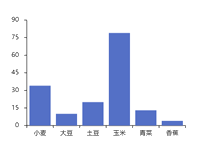

# [plain-chart](https://clunch-contrib.github.io/chart/)
一个比 Apache ECharts 更简单的开源可视化图表库

<p>
  <a href="https://hai2007.gitee.io/npm-downloads?interval=7&packages=plain-chart"></a>
   <a href="https://www.jsdelivr.com/package/npm/plain-chart"></a>
  <a href="https://www.npmjs.com/package/plain-chart"></a>
  <a href="https://github.com/clunch-contrib/chart/blob/master/LICENSE"></a>
  <a href="https://github.com/clunch-contrib/chart">
        
    </a>
</p>

## Issues
使用的时候遇到任何问题或有好的建议，请点击进入[issue](https://github.com/clunch-contrib/chart/issues)，欢迎参与维护！

## How to use?

首先你需要通过命令行安装，就像这样：

```
npm install --save plain-chart clunch
```

>（温馨提示：本项目的运行依赖[clunch框架](https://hai2007.gitee.io/clunch/)，所以也需要安装。 ）

安装好了以后，直接引入即可使用：

```js
import PlainChart from 'plain-chart';
```

或

```html
<script src='https://cdn.jsdelivr.net/npm/plain-chart@1'></script>
```

我们以绘制下面的一个柱状图为例来演示：



### 1.准备画布

```html
<style>
#canvas {
    width: 100vw;
    height: 100vh;
}
</style>
<div id="canvas"></div>
```

### 2.获取图表对象

```js
 var myChart = PlainChart.init(Clunch, document.getElementById('canvas'));
```

### 3.创建图表

```js
myChart.new({
    type: "bar",
    data: [34, 10, 20, 79, 13, 4],
    xAxis: {
        values: ["小麦", "大豆", "土豆", "玉米", "青菜", "香蕉"]
    },
    yAxis: {}

});
```

如果你想查看上面例子的在线效果，可以直接访问： https://hai2007.gitee.io/sweethome/#/editor?file=plain-chart_bar_simple

你还可以设置柱状图的更多细节或者是绘制别的图形，当然，添加交互事件等也是可以的。

具体的使用你可以[查阅文档](https://clunch-contrib.github.io/chart/)哦~

开源协议
---------------------------------------
[MIT](https://github.com/clunch-contrib/chart/blob/master/LICENSE)

Copyright (c) 2021 [hai2007](https://hai2007.gitee.io/sweethome/) 走一步，再走一步。
